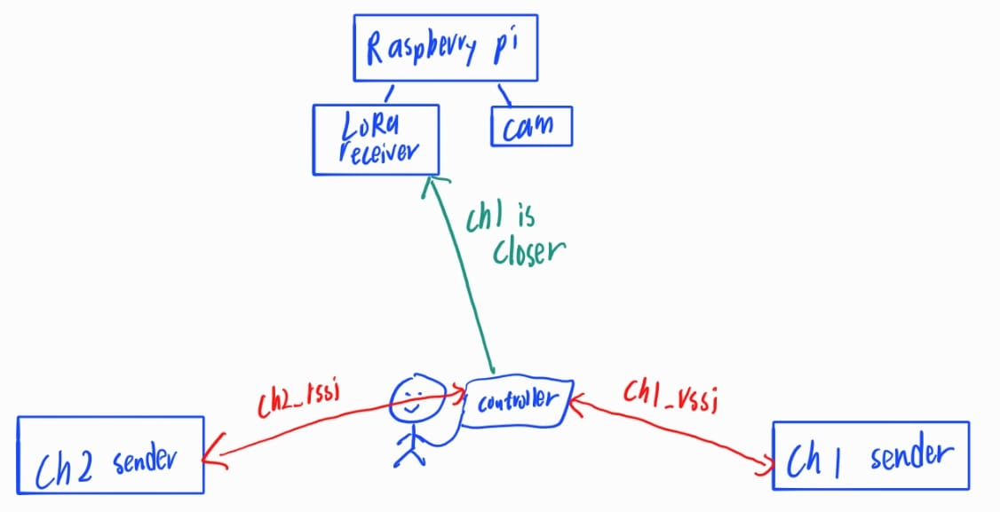

# Lora Setup and explaination

## Hardware List (in this section)

- ESP32 WROOM module
- SX1278 LoRa module 
- 0.96 inch OLED Display

## Sources that I copy from (for oled and LoRa module):

1. https://randomnerdtutorials.com/esp32-ssd1306-oled-display-arduino-ide/
2. https://www.instructables.com/ESP32-LoRa-Transciever/

## BLE Keyboard 
- The modified library is attached here since the common one found in internet have some issue for the latest arduino version (mainly about the string and std::string problem)

## Explaination
There are 3 ino file for different purpose of the LoRa module:
1. **esp32_s3_lora_ble_controller**:
- the one which the presenter will hold the thing during presentation
- allow the presenter to press right/left arrow button to control the ppt slides

2. **esp32_s3_lora_receiver**: 
- the one which connected to Raspberry pi

3. **esp32_s3_lora_sender**: 
- there are 2 senders (i call it ch1 and ch2), the purpose of them is to put at the classroom sides 

## How does this system work?

  

1. The ch1/2 sender will send signal alternatively(ch1 -> ch2 -> ch1......)

2. The controller will get the RSSI values(ch1_rssi and ch2_rssi) from both senders, then compare which one has larger value

3. The controller will send which channel is closer (the one will higher rssi value) to the receiver (the one connected to Raspberry Pi)

